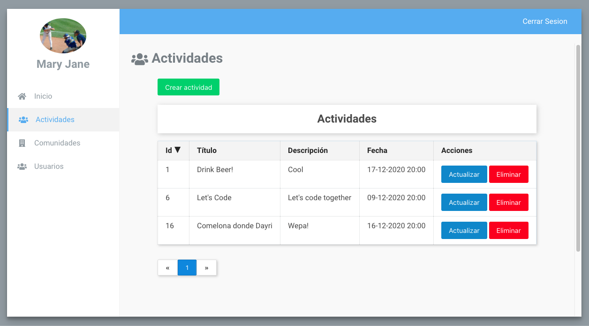

# Activities App
An application for communities to create activities and get together.

## API Status

  
## Web Status

 

## Table of Contents

* [Features](#features)
* [Screenshots](#screenshots)
* [Setup](#setup)
* [Contributing](#contributing)
* [Contributors](#contributors)
* [License](#license)

## Features

* Users can be part of communities
* Users can create activities, invite others, being invited and accept / reject those invitations.
* Users can update their profiles.

## Screenshots

  

  

  

  

  

  

  

  

  

## Setup
To setup the project follow the instructions:
- [API Setup](api/README.md)
- [Web Admin Setup](web/README.md)
- [Mobile App Setup](mobile/README.md)

## Contributing
See [CONTRIBUTING.md](CONTRIBUTING.md)

## Contributors

|  [Victor Trejo](https://github.com/xvicmanx) |   [Dayri Garcia](https://github.com/dayrimax91) |
|-------------|-------------|

## License
Activities App is open source software licensed as [MIT](LICENSE.md)
